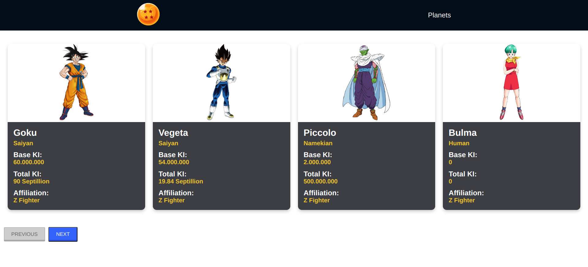

# Front-end Projects

1. **Counter**

   - A simple counter application that allows users to increment and decrement a numerical value. Great for understanding basic state management and DOM manipulation.
   - **Technologies:** HTML, CSS, JavaScript
      
     

---

2. **Pokémon Finder**

   - An interactive application that fetches and displays information about Pokémon characters using the Pokémon API. Users can search for their favorite Pokémon by name.
   - **Technologies:** HTML, CSS, JavaScript, API Integration
      
     

---

3. **Dragon Ball Characters**

   - A dynamic app that showcases characters and planets from the Dragon Ball series. Users can view characters and planets, enhancing their knowledge of the series.
   - **Technologies:** HTML, CSS, JavaScript, API Integration
      
     
      
     

---

4. **To-Do List**

   - A simple and intuitive to-do list application that helps users organize their tasks effectively. Users can add, remove, and mark tasks as completed.
   - **Technologies:** HTML, CSS, JavaScript
      
     

---

5. **Calculator**

   - A functional calculator that performs basic arithmetic operations. A great project for practicing event handling and user input validation.
   - **Technologies:** HTML, CSS, JavaScript
      
     

---

6. **Breaking Bad Quotes Generator**

   - An engaging application that generates random quotes from the TV show "Breaking Bad". Users can click a button to get a new quote.
   - **Technologies:** HTML, CSS, JavaScript, API Integration
      
     

---

7. **Currency Converter**

   - A useful application that converts values between different currencies using live exchange rates. Users can select currencies and input amounts to get conversions.
   - **Technologies:** HTML, CSS, JavaScript, API Integration
      
     
